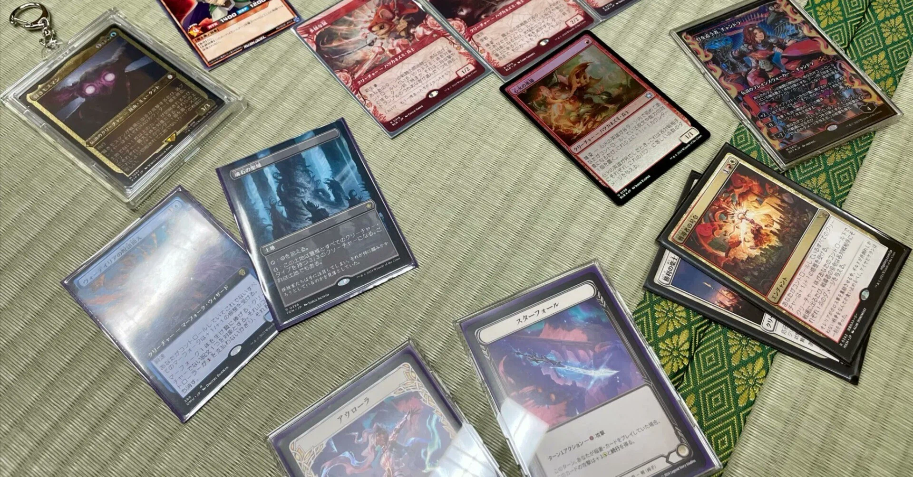
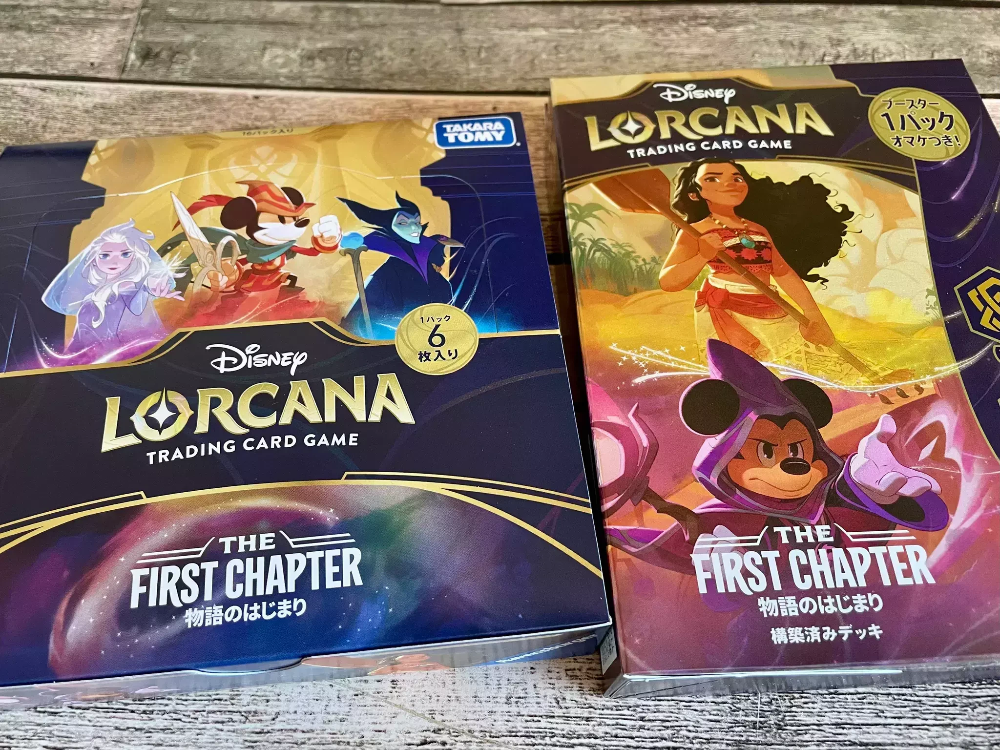
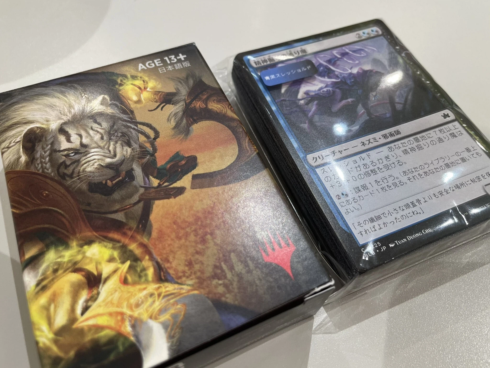
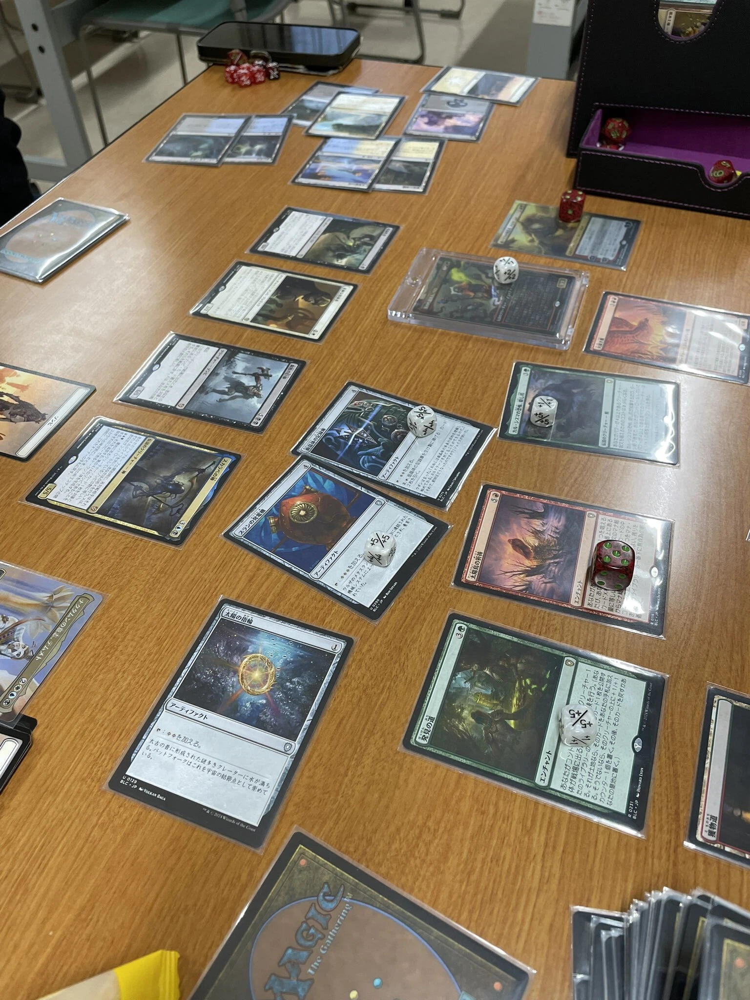
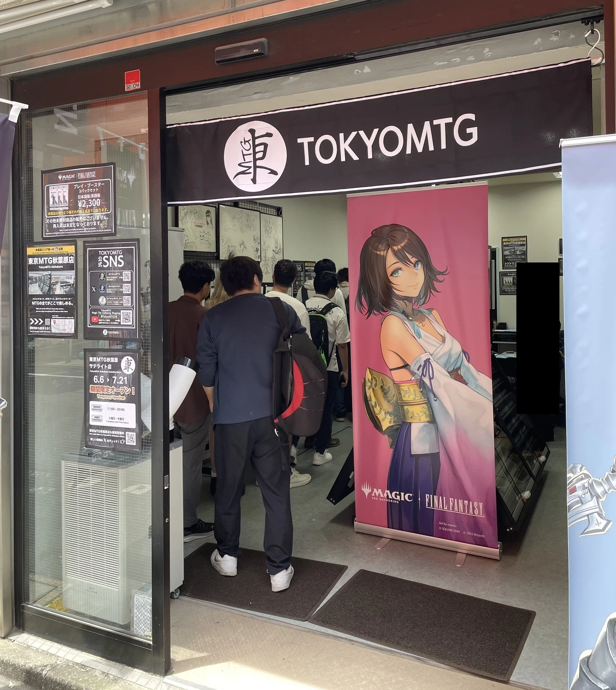
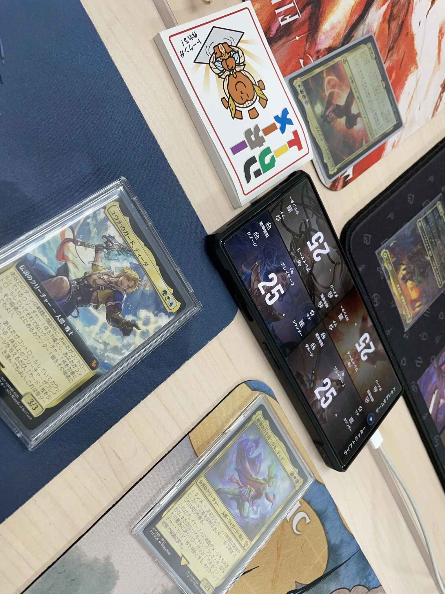
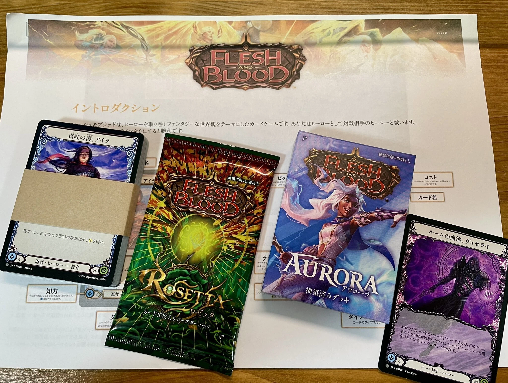
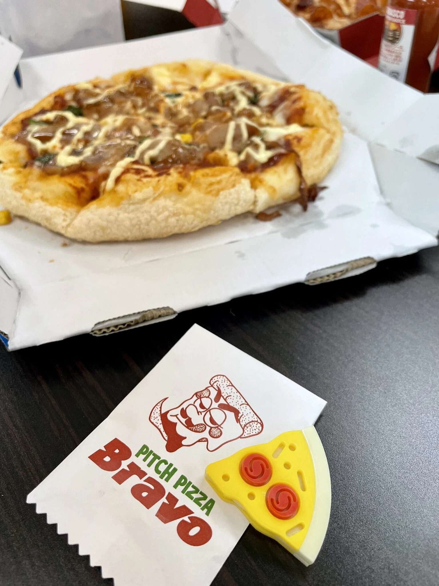

&#x3000;2025年の2月に突然カードゲームを始め、気付くと半年が経っていました。普段から色々な事に手を出してはサッと飽きてしまう傾向にあるのですが、そんな中でも定期的に遊び続け、こうして記事を書くまでになるとは想像もしておらず自分でも驚いています。

　この記事はカードゲーム初心者がディズニーロルカナを始めてからMagic The Gatheringを通り、Flesh and Bloodにハマるまでを振り返る内容になっています。※ゲーム自体の内容やテクニック的なことはあまり書いていませんのでご注意ください。

---

## はじめに

### 自己紹介

&#x3000;まず私自身について。普段はデジタルゲームを遊んだり作ったりしています。

&#x3000;ただのゲームオタクである一方でアナログゲームにも興味があり、ゲームマーケットに行ったり個人でボードゲーム会を主催して遊んだりしています。仕事柄もあり、とにかく『ゲーム』と呼ばれるものには浅く広く興味があるほうだと思います。

### カードゲーム歴

&#x3000;カードゲームは対戦という形で遊んだことはなく、子供の頃に付録などでポケモンカードゲームに触れたことがある程度でした。それ以来カードゲームに触れることはほとんどありませんでしたが、今になってこんなにハマるコンテンツになるとは……。人生はいつ何があるか分かりませんね。

## 2025年1月末：はじめてのカードゲーム

### ロルカナとの出会い

&#x3000;カードゲームに興味を持ち始めたのは『ディズニーロルカナ』がきっかけでした。時期的に日本語版第1弾の発売直前で「ディズニーもTCGやるんだな」と思った記憶があります。

&#x3000;さっそくどんな感じなのかと公式サイトでルールを覗くと、なんだかボードゲームっぽい雰囲気があります。調べたところ開発のRavensburger社はパズルやアナログゲームも作っているメーカーのようで、なるほどなと納得。ボードゲームの中でもカードを使って遊ぶものはよくあるため、プレイの想像はしやすかったです。

&#x3000;また、多人数での遊びが想定されていることにもボードゲームっぽさを感じ、これは面白そうだと思いました。その後気がつけば最寄りの販売店へ駆け込み、1ボックスとアンバーアメジストの構築済みデッキを買って、さらにボックスから **≪ラプンツェル　いやしの賜物≫** を引くという謎の強運を発揮して、ロルカナの世界へと入り込んでいくのでした。

*あるあるですが、初心者が強レアを引く体験はインパクトがありますね。*

### いざ初プレイ

&#x3000;そんなこんなで遊ぶ準備ができたものの、対戦相手がいないことにはロルカナを最大限に楽しむことができません。どうしたものか……と思っているところで、2月に主催のボードゲーム会が控えているのを思い出します。

　**「幹事権限でロルカナを持ち込めばいいのでは？」（強引）**

&#x3000;偶然にもロルカナへ興味を持っている参加者が他にもいたので事前に声をかけ、当日は（何もしらない他参加者を巻き込みつつ）4人対戦まですることができました。自分含め初見でも遊びやすいルール、ディズニーを知っていても知らなくても楽しめるフレーバー、『歌』というディズニーを象徴する他にないシステムなど、どれも魅力的で新鮮な体験になりました。

&#x3000;なおロルカナについてはこの時遊んだ1人が私以上にハマってくれて、個人で外部イベントに参加するほどのようです。嬉しい限り。

>ロルカナの面白さについても語りたいところなのですがここでは割愛します。個人的にはチャレンジ/クエストで寝かせるか立たせておくかの攻防が奥深いなと思っています。あとは『勝利点として＜ロア＞を稼ぐ』という表現が世界観にあった優しさを感じて好きです。

## 2025年2月：元祖TCGの道へ

### 流れにのってMTGへ

&#x3000;ロルカナをやろうとなったくだりで、それならMTGもできるよ！という話が浮上します。

&#x3000;『**Magic The Gathering（MTG）**』――私ですらその名前とブラックロータスの存在くらいは知っている、元祖TCGです。どうやらロルカナもベースのルールはMTGに似ている部分があるようで、せっかくTCGを始めるならこっちもやってみようよという流れになりました。

&#x3000;ボードゲーム会の場所が秋葉原の近くなのですが、ちょうど専門店があり、初心者用のデッキは無料でもらえるらしいとのこと。「でも難しいんでしょう？」と思いつつ、気がつけばそのボードゲーム会の帰り（！）に数人でショップへ寄り、全員がウェルカムデッキを手にすることとなったのでした。**みんなフットワークが軽すぎる。**

なんなら初心者デッキまで買ってる勢い。

&#x3000;MTGを始めるにあたって、私の場合は「**存在を知ってはいるけど始める機会がなかった**」という層と「**昔やっていたけど今は全然**」という層が周りにいたことが大きかったと思っています。また、以前から発表されていたファイナルファンタジーコラボ（6月発売）が控えていることもあり、それに向けて始めるには絶好のタイミングでした。

### 色々なイベントに参加して

&#x3000;それからは初心者体験会に参加し、友人たちと統率者などでも遊びつつ、タルキール龍嵐録が発売する4月にはプレリリースイベントに参加するまでになりました。これが知り合い以外と対戦する初めての機会だったように思いますが、同じように初心者の方がいたり、慣れてる方の時は逆に色々教えてもらったりと、とても楽しい1日だったのを覚えています。その後、横浜で開催された『マジック大戦祭』にも友人たちと参加するのですが、体験会やプレリリースで楽しめた経験があってこその参加になったと思います。

ろくにプレイマットも持ってない頃の写真。

&#x3000;この頃は月1～2くらいでロルカナなりMTGなりを遊んでいました。そもそも購入できるかどうかも心配だったFFコラボも無事に入手でき、もちろんプレリリースも参加して統率者も遊んで、順番が前後しますがFaBの新弾も出て、その裏でSwitch2が発売されたりで**6月は本当に忙しかった……。**

&#x3000;FFコラボについては、発売してから始めるつもりだと絶対買えなかっただろうなと思うので、事前にプレイする環境を持てたのは本当に良かったです。ここまで付き合ってくれたみんな、ありがとう……。

東京MTGさんのサテライト店に初日凸したり。

FF統率者やったり（1人だけ別次元から出演してる）。

&#x3000;FF環境がひと段落してからはすこしまったりして、オリジナル統率者を作ったり、各々でイベントに参加したりしながら引き続きゆるく遊んでいます。ちなみにMTGでも、このコミュニティで始めたことがきっかけで私より積極的に楽しんでくれている人たちがいて、とても嬉しいです。

>MTGの面白さをこれと語るには歴史がありすぎるのですが、個人的には世界観寄りに楽しんでいるかもしれません。ブルームバロウの動物モチーフの世界が好きでカワウソデッキを使っていたし、霊気走破シナリオのクイックビーストも大好き。アラクリア次元いつ出ますか？？

## 2025年4月：さらに別のTCGへ

### FaBとの出会い

&#x3000;カードゲームをしていると、当然ながら他のカードゲームの情報もたくさん入ってくるようになります。特に日本は豊富なキャラクターコンテンツを使ったタイトルに溢れており、ポケカをはじめとした安価なものも多く……興味を持ったのは『**Flesh and Blood（FaB）**』でした。本当にナンデ？？

&#x3000;初見がどこだったか忘れてしまったのですが（おそらく晴れる屋TC東京へ入り浸っていたせい）、記録を振り返ると4月に初心者体験会を受けていました。これがとっても面白く、戦闘に特化したシステムやヒーローごとのプレイ感の違いなどは他のTCGにはない良い部分だと感じています。

ヴィセライに興味を持って行ったら「禁止ヒーローで～」と言われた思い出。

&#x3000;体験会の後はそのままアウローラ1stストライクの構築済みデッキを買って、ドキドキしながらビギナーイベントに参加したりして。先述の通り他の遊びが忙しいなどであまり頻繁にはプレイできない状態が続いていたのですが、最近はそれらが落ち着いてきたのもあってようやくしっかり遊べるようになりました。

### 一人でも楽しめる理由

&#x3000;ちなみにここまで複数人で遊んでいたカードゲームですが、FaBに関しては基本的に一人でイベントへ参加しています。もちろん誰かと一緒に楽しみたい気持ちもあるのですが、現状はロルカナもMTGもみんなそれぞれが気に入ったタイトルを楽しんでいるようなので、それはそれで良いかなと。

&#x3000;私の中で今一番アツいのがFaBなので**「めちゃくちゃ面白いよ～！！」**というのはまた別な記事にでもするとして、一人でも楽しめているのはコミュニティの暖かさがあるように思います。まだまだプレイヤー数が少なく良くも悪くも「村」といえる規模ではあるのですが、それ故なのか新規プレイヤーに対しては非常に手厚く接してくれている印象があります。もちろん普段私が参加しているのはカジュアルイベントなので、競技性が高くなってくるとそうもいかないかもしれません。ですが大きなイベントでの様子を見ていても、どれも和やかな雰囲気で開催されているような気がしています。

&#x3000;最近はショップの店員さんにも声をかけていただいたり、コミュニティの中でも少しずつ顔見知りができたりして、カードを遊ぶだけではない楽しさも増えてきました。FaBは今後も楽しみなイベントが控えているので、引き続き遊んでいきたいなと思います。

ピザ付きカジュアルイベントの「メシーエス」　楽しかった！

## 2025年8月：半年を振り返って

&#x3000;冒頭にも書いたとおり飽きやすい性格なので、このカードゲームの波も一通り遊びきったら落ち着くかなと思っていました。それが気がつけば半年経ち、長く遊びたいと思えるようなFaBとも出会い、こうしてnoteを書いたりSNSのアカウントを作ったりして「新しい趣味ができたかも」と思うほどになりました。

&#x3000;さすがに全部を同じ熱量で続けていくのは時間的にも金銭的にも難しいのですが、どれもまだまだ遊びたい気持ちはあります。FaBをメインにしつつ、ロルカナやMTGはおいしいところをつまみながら、さらに新しいTCGを探したりしてこれからも楽しんでいきたいです。

## 最後に

&#x3000;ここまでわがままに付き合ってくれた友人たち、道中で対戦したプレイヤーや、SNSやショップのコミュニティでお世話になっているみなさん、本当にありがとうございます。

&#x3000;相手あっての遊びなので、もし一人で始めていたら途中で心折れていたかもしれなかったです。これからもよろしくお願いします。
