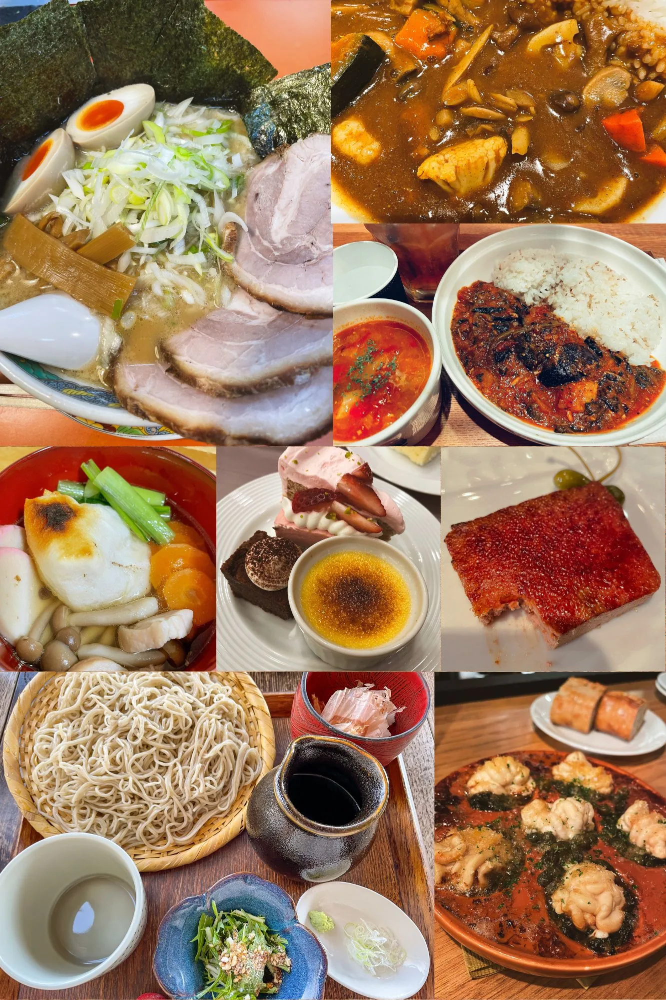
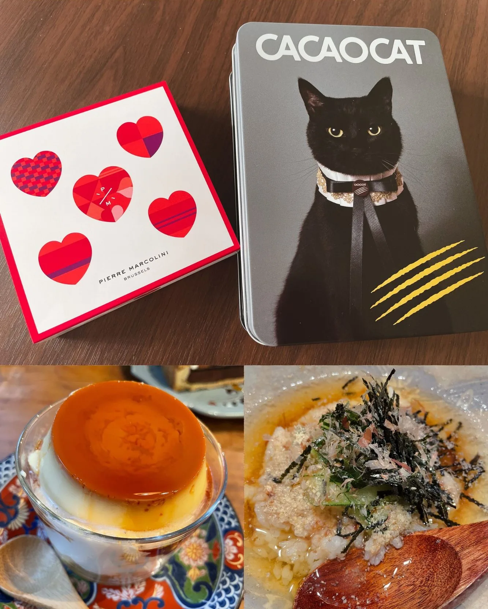
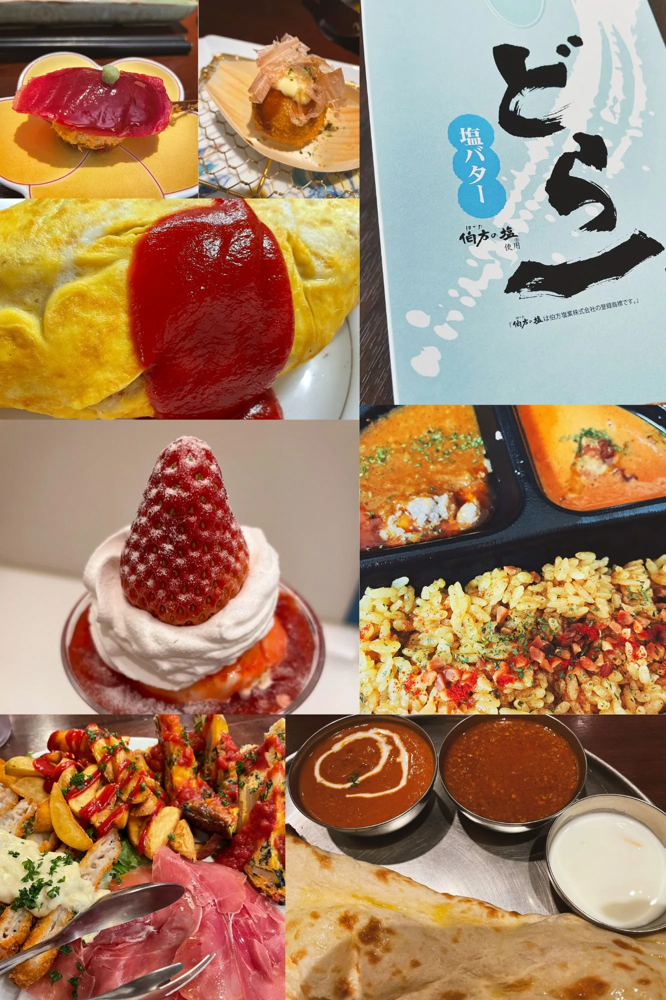
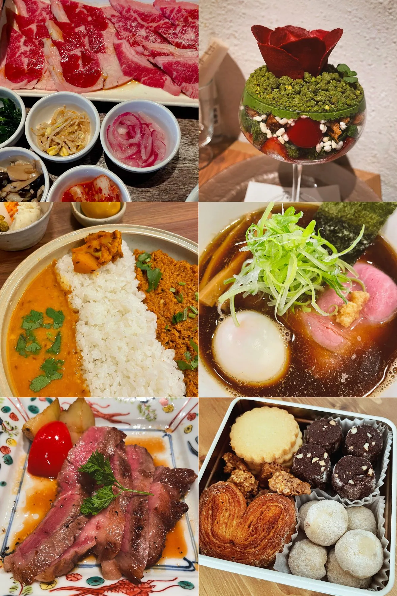
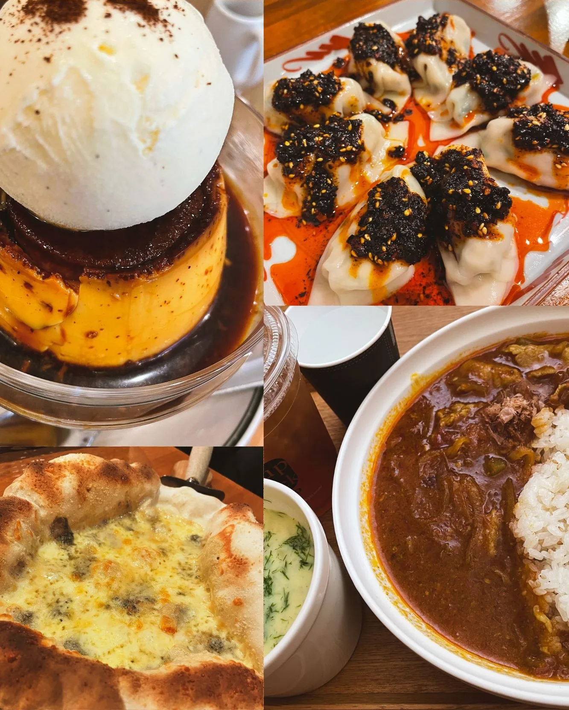
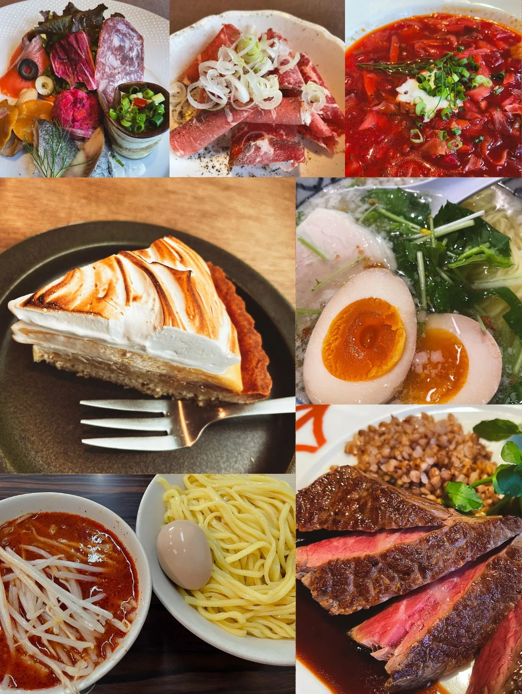
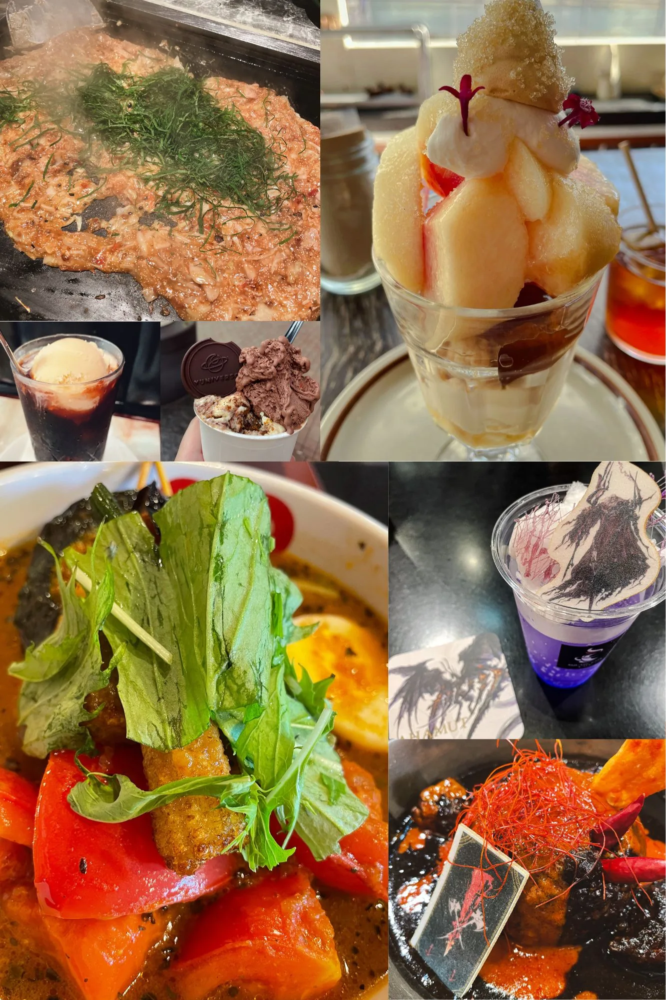
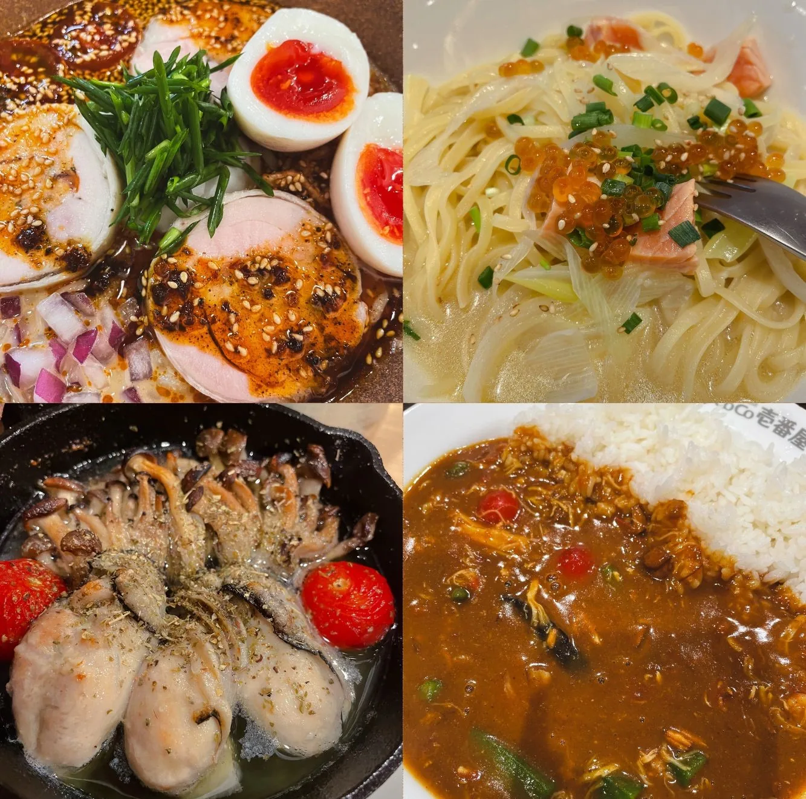
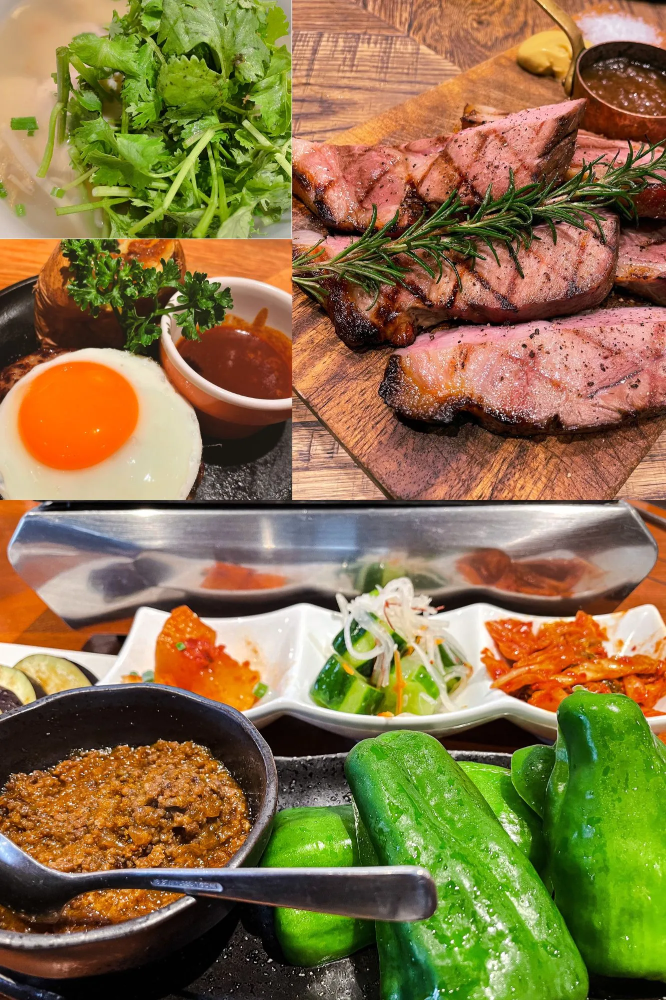
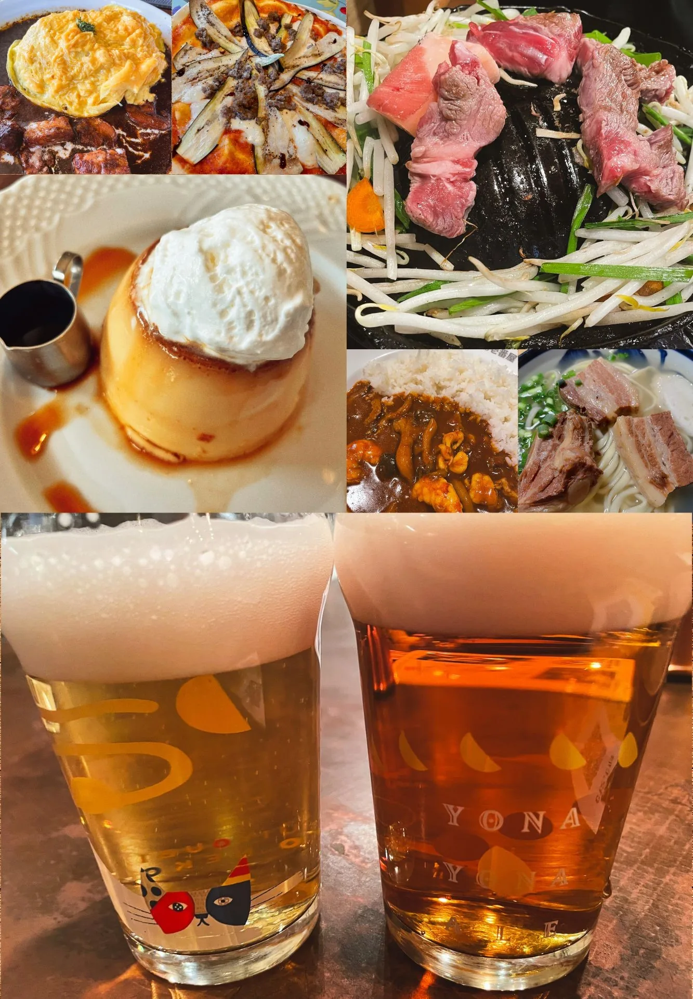

**この記事は Otaku Social（おたそ～）Advent Calendar 2023【青展示棟】 2日目の記事です。**

---

今年食べたものを雑に紹介していくよ！  
よりおすすめだったものは詳細載せておくのでぜひ食べ納めにご活用ください。

※気持ち左上→右下でコメント付けています

## 1月

- いつものラーメン屋さんに年始の挨拶行ったやつ
- ココイチはじめの冬野菜カレー（筆者はカレーが好きです（テストに出ます）
- スープストックも好き
- お雑煮！
- 年明け早々に知人の挙式に参加したときのデザートビュッフェ
- 食べかけを載せるな　お気に入りビストロのレバーパテ
- 初詣＠深大寺の近くの蕎麦屋さん　大人向けな雰囲気で落ち着いててよきでした
  - 📌蕎麦るりり（東京都調布市深大寺元町4-31-5）
- 白子のオーブン焼き的なやつ　↑のビストロと同じ日のやつ

## 2月

- バレンタインチョコ　ネコチャン！
- 三鷹あたりのカフェの硬めプリン
- 飲み屋の〆の出汁茶漬け

## 3月

- 串カツ屋さんでの珍しメニュー（寿司とたこ焼き）
  - 📌銀座　串かつ凡（東京都中央区銀座8-2-8 銀座高本ビル3F）
- おたどんでおすすめ見てお取り寄せした「どら一」　塩気が絶妙
- 町中華のオムライス　こういうのでいいんだよ
- いちごパフェ🍓
- セブンのカレーフェスの時のビリヤニ（12/11から再販です！！！）
- イタリアンのやんちゃな前菜盛り
- ナンもすき

## 4月

- 誕生日の焼肉ランチ
- ずっと食べたかった夜パフェ（抹茶系の和風味）
  - 📌夜パフェ専門店パフェテリア ベル新宿三丁目店（東京都新宿区新宿3-8-2 クロスビル 4F）
- 推しのカレー屋　混んでほしくないけどもう大分並ぶようになってしまった…
  - 📌カレーショップ フェンネル（東京都杉並区松庵3-37-22 2F）
- シンプル系中華そば
- 天ぷら屋のコースでなぜか出てきた肉
- アディクトオシュクルのクッキー缶

## 5月

- アイス乗せプリン　カラメル別で注文できるのがよき
  - 📌ALL SEASONS COFFEE（東京都新宿区新宿2-7-7 1F）
- 四川風麻辣水餃子※ググった
  - 📌餃子坊 豚八戒（東京都杉並区阿佐谷南3-37-5）
- チーズとはちみつのピザ　最高だよね
- スープストック

## 6月

- 前菜盛りと冷凍削り肉とビーツのボルシチと右下の肉
  - 📌Russian Restaurant ROGOVSKI（東京都中央区銀座5-7-10 イグジットメルサ7F）
- レモンタルト🍋
- ミニ通堂うま塩ラーメン＠新横浜ラーメン博物館
- 辛みそつけ麺

## 7月

- 明太もんじゃ＠月島
- 桃パフェ
- 喫茶店のコーヒーフロート
- ユニベルゾのアイス　もんじゃついでのやつ
- SUAGEのスープカレー　トマト丸ごと一個とかでおいしかった
- スクエニカフェのFF16コラボメニュー（上：ドリンク、下：カレー）

## 8月

- 冷やし坦々麺的なやつ
- サーモンといくらのパスタ
- 牡蠣のアヒージョ
- ココイチの夏野菜カレー　毎年食べてる

## 9月

- 鶏のフォー　パクチー大盛
- 四万十ポークのグリル
  - 📌ウルビアマン（東京都千代田区外神田4-14-1 秋葉原UDXビル1F）
- 目玉焼きのせハンバーグ　地味に後ろのイモがうまい
- 生ピーマンに牛そぼろ乗せて食べるやつ　最高

## 10月＋11月

- オムハヤシ
- ナスとトマトのピザ
- ジンギスカン　生ラム最高
- 星野珈琲店の昭和のプリン
- ココイチの海老カレー
- 沖縄そば　定食セットのじゅーしーもおいしかった
- よなよなビールと水曜日のネコ　生が良すぎる
  - 📌YONA YONA BEER WORKS（都内に何店舗かあるよ）

---

カレーは食べてる自覚あったんですが意外とプリンも登場率高くて驚きました。  
気になるお店があったらぜひ行ってみてくださいね。

来年もおいしいものがたくさん食べられますように！
