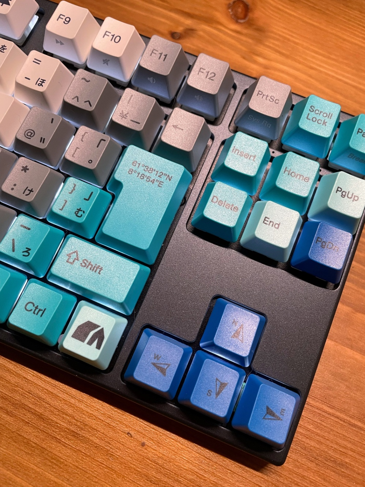

&#x3000;たまたま見かけてデザインに一目ぼれして、そこから1週間くらい悩んで「このままだと一生キーボードのことを考えて過ごしてしまう…！」と思ったので潔く購入した。見た目はこんな感じ。雪山がテーマだそう。

　照明の都合でちょっとオレンジみが強いけど白とグレー、水色から青のグラデーションが彩度高めでとても気に入っている。ちょっとしたキーの装飾も良い。十字キーがコンパスみたいになってるところとか。あと光る。

　いわゆるメカニカルキーボードというやつで、とはいえ何がすごいかというと別に特化したことは無いように思う。強いて言えばキーキャップが交換できるので色々こだわれるくらい…？この手のものは「軸」という要素があって、用途に応じて向き不向きがあったりするらしいけど自分は完全に打鍵感で選んだ。このブランド専用の軸なので完全にそれとは言えないが、一般で呼ばれるところの「茶軸」に近いはず…と思っている。※購入したのはVARMILOのIris軸

　実際に半日ほど使った感想としては本当に打ち心地がいい。どちらかと言うと赤軸の方が長時間の使用には向いてたりするらしいものの、個人的には「押した感」が欲しかったのでこのカコカコする感じには満足している。今こうやって記録を残しているのもキーボードを叩きたい欲があるからなので、そう思えるくらいには気に入ったということで。あ、でもスペースキーだけキーが大きいせいなのか打った時にパコパコしてしまうので、何かしらの対策は考えたいところ。静音リングとか効果あるのだろうか…。

　ちなみにこれまでは2000円くらいで購入した、ワイヤレスの適当なパンタグラフ式のキーボードを4年ほど使っていた。製品としては申し分ないものの、無線の仕様上、数分動作がないとスリープ状態になって復帰に数秒かかるというのと、PC側の調子がよくないのかBluetoothごと切断されることが日に何度か発生していたのでそのストレスから解放されたのは大きなメリットに思っている。我が家にはコード類が大好きな猫もいるのでその点において有線へ変更することには不安があったが、このキーボードはUSBで接続しているだけなので、もしもがあっても取り換えが効くというのも安心ポイントである。

　肝心のお値段は「相場に比べたら割高かな…」というのが正直な感想。少し下の価格帯で性能としては同程度かそれ以上が買える場合もあったものの、デザインが無難of無難なためそこから自前でキーキャップを交換して～と考えると結局同じくらいになってしまうこともあり、元のときめきを信じよう！ということでその辺の差額はデザイン費として割り切った。結果見た目には満足しているし、使い心地も十分なので良い買い物をしたと思っておく。

　キー配置も変わり、まだまだ慣れないところはあるのでこれからたくさん使って手に馴染ませていきたい。おわり。
