---
title: "例のお粥鍋を食べるために幹事をしてきた話"
description: "横浜中華街で話題のお粥鍋を食べるため、16人以上を集めて幹事をした記録。募集から当日の食事、会計まで。"
date: "2024-12-08"
tags:
  - ご飯
  - 外食
  - 横浜中華街
draft: false
archive: true
slug: "okayu-nabe-kanji-2024"
---

&#x3000;数年前に当時のTwitterでバズっていたのを見て、いつか行こう行こうと思って行動に移せないままでおりましたが、ふと「今しかない！」という謎の衝動によりこの度例のお粥を食べる運びとなりました。

&#x3000;「例のお粥」ってなんぞ？という点については既に先人たちのレポートがたくさん挙がっているのでそちらをご覧ください。ちなみに大体ネタバレです（？

::link-card{url="https://note.com/potamaru/n/n2bef484fa631" title="毋米粥という名のコミュニケーション〜1人1万円のお粥を食べてきた" description="横浜中華街の南粤美食で、16人以上で味わう高級お粥鍋「毋米粥」を体験したレポート。" siteName="note.com"}

::link-card{url="https://fromatom.hatenablog.com/entry/2023/08/10/100000" title="南粤美食でお粥の会を開催した。" description="南粤美食のお粥コースを開催した記録。予約条件やコース内容、豪華な具材の流れが分かるレポート。" siteName="fromatom.hatenablog.com"}

::link-card{url="https://dailyportalz.jp/kiji/1man_yen-okayu" title="一人前一万円のお粥「毋米粥」を食べた" description="デイリーポータルZによる毋米粥の体験記事。南粤美食で味わう一万円のお粥コースを詳しく紹介。" siteName="dailyportalz.jp"}

&#x3000;ということでこのお粥鍋、食べるためには以下の条件があります。

* 横浜中華街のお店まで来れること
* 1人1.5万ほどの参加費を払えること
* 人数を16名以上集めること

&#x3000;参加費も参加費なんですが、なにより人数がね…！！

&#x3000;しかし時は年末、デカい催しをするには今しかない…あと多分みんな忘年会とかで忙しいから早めに確保しなければ…！

&#x3000;私の人望と行動力が試される一大イベントがここに始まろうとしている――

## まずはチラシをつくります

&#x3000;その前に少しコミュニティの話をします。もう最初がいつだったか覚えていないのですがコロナであーだこーだする以前からボードゲームを遊ぶ会を開催していまして。大体1年に2～3回、15人程度の集まりなのですがそれが10月にあったんですね。ちなみに参加者はTwitter時代からゲーム絡みで交流のある人だったり、その人達の友人だったりでまあざっくばらんなメンバーになります。なんならフォロワーの会社の同僚とかいる。謎。

&#x3000;もちろんみんな匿名で、いわゆる「オフ会」と称される集まりなのですが、何だかんだ数年定期的に集まっていて、アフターで飲み会などもしていたのでそれなりに気軽に会ったり飲んだりできる人達というわけです。

&#x3000;で、丁度10月のボドゲ会の前に先述の「今しかない！」という天啓が降ってきて、ついでに参加者を募るにはここで宣伝するしかないと考えたものの、参加費は安くないし、その参加費にも色々理由があってのことだし、人数も必要だし…と説明することが多すぎる。限られた時間で分かりやすく、それでいて参加しようと思ってもらいやすくするためにはどうするか……やっぱりパッと見ですべてが分かる画像が早くない？

**チラシを作れば良いんじゃない？？？**（ボドゲ会前日のひらめき）

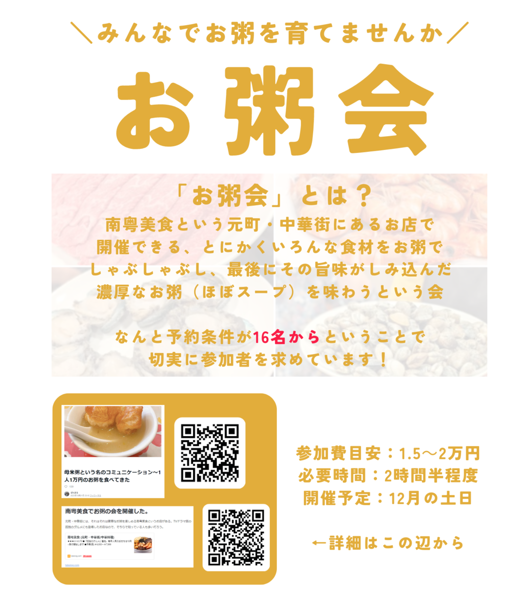

&#x3000;作りました。前日に。クオリティは気にするな。  
&#x3000;なんならその日のうちにコンビニで印刷してきました。我ながらびっくりする行動力ですね。

&#x3000;ちなみに先ほどリンクを貼った記事をQRコード化して、チラシから直接飛べるようにしていました。細かい話はああいうのを見てもらった方が早いので…（先人たちに感謝

&#x3000;ボドゲ会当日はチラシを配りながら「絶対値段の価値はあるから～たのむ～～」とひれ伏していました。私の周りはなんか楽しそうなことが好きなおもしろ人間が多いので、いいじゃん！と言ってくれる人がいたり、気になるけど都合が…という人がいたりで反応は半々くらい。とりあえず「いいじゃん！」組に個別で連絡をしつつ、日程を先に決め打ちしてしまって後から人をかき集めようという作戦でいくことにしました。

## 参加者集め

&#x3000;いいじゃん組とそこから数名お誘いしてもらって13人になり、必須の16人まであと3人。これ以上は他から増えそうにないし、私がなんとか絞り出すしかない…！ということで他コミュニティの方へもお声がけさせてもらいました。都合でNGだった人もいるんですが、こんなハードル高めのお誘いに初対面で快く応じて頂いた方々には本当に感謝しています。あなたのお陰で他13人が救われました…。

&#x3000;そんなこんなで必要人数も揃い、予約も済ませたのであとは体調管理とやむを得ないキャンセルにひやひやしながら当日を待つのみ。最終的には17名になり、予算だけでも25万円（！）のビッグな会になりそうです。ここまでくると幹事的には半分以上やることやった感があるのでようやく一息つける印象がありますね。ふう。

## いざお粥鍋だ！

&#x3000;無事、欠席者が出ることもなく当日を迎えることができました。めでたい。

&#x3000;看板の写真を撮り損ねていてなんも雰囲気がない記事でアレなんですが、通常のお客さんがたくさん並んでいるところをファストパスさながらスッと入店していくのはちょっとテンション上がりますね。

&#x3000;ここからはお粥道中の写真とともにお送りします。

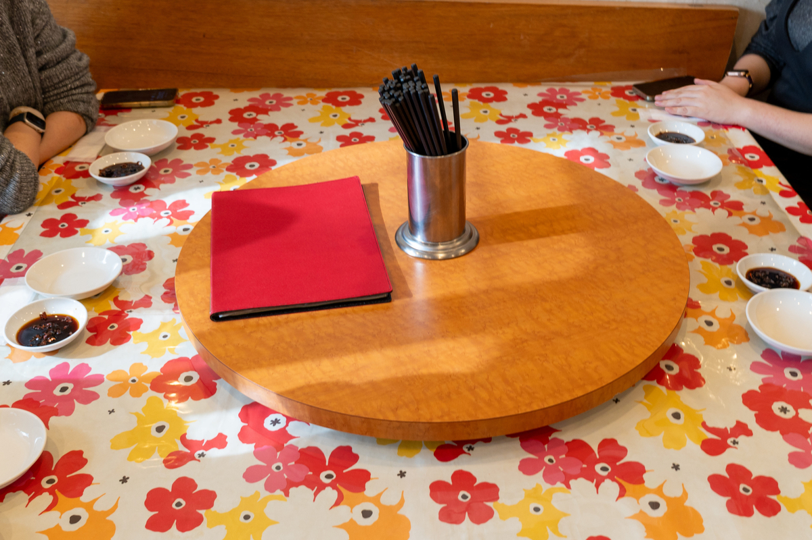

&#x3000;開始前のテーブル。中央の円台は回転するやつで中華みを感じます。  
&#x3000;これが反対側にもう1卓あって、なんとなく2グループに分かれる感じに。

&#x3000;予約の最低人数が16人、最大が23人らしいんですがお店のスペースとこのテーブルを見ても16人程度が丁度良いのではないかと思われます。20人とか席入るのか…？

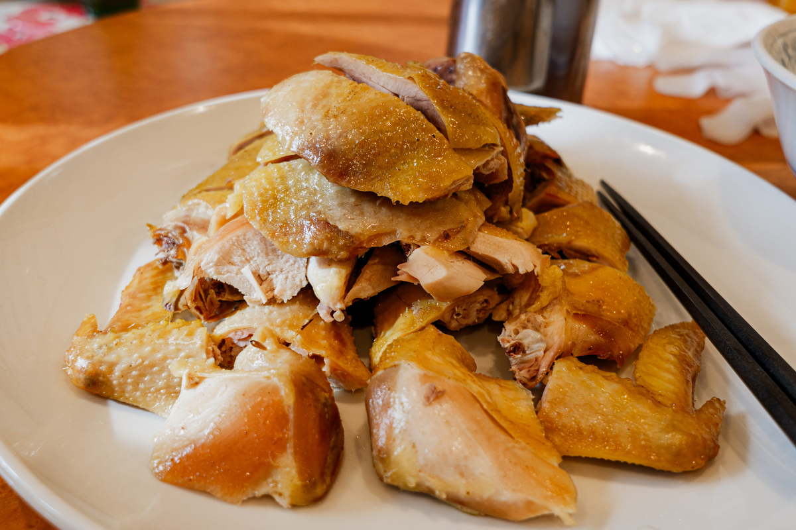

&#x3000;お通し的に出てくる塩蒸し鶏。身に鶏の旨味が凝縮されてる味だった…！

&#x3000;写真が無いんですがビールはチンタオビールが出てきます。瓶が運ばれてくるのでグラスに注ぐのかな～と思ってたら普通に直飲み推奨だった。いいですね。

&#x3000;ソフトドリンク枠は烏龍茶とマンゴージュースでした。マンゴージュース、見た目からして濃厚そうだったので1杯くらい飲んでおけば良かったな…。

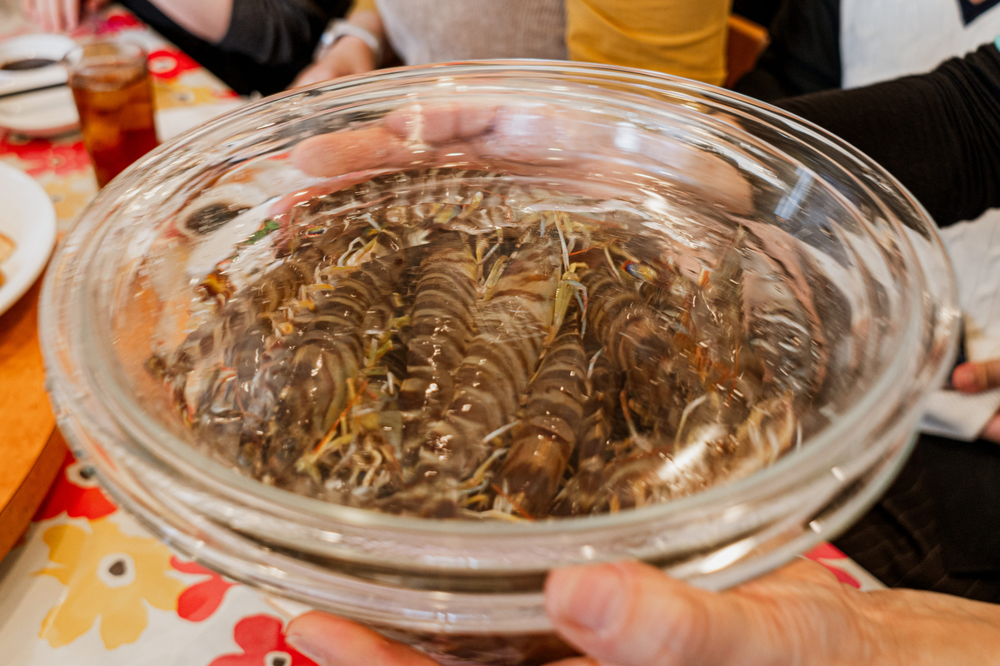

&#x3000;塩鶏うめえしてる後ろで着々と準備は進んでおり、最初に運ばれてきた食材はエビ！まだ辛うじて意識があるようで足がピクピクしてる…。

&#x3000;食材に関してはこんな感じで、お粥へ投入される前に店員さんが見せてくれます。撮影タイムということなんですがこの提供スピードが思ったより早くてですね。（食べている途中なので）写真を撮る余裕がない！というターンが度々発生していたので、ここで紹介するものもちょっと抜けがあったりします。ご了承を。

&#x3000;ちなみにお粥に関しては基本的に店員さんがすべてやってくれていて、鍋で煮る人、食材を運ぶ人、その他片付けとかをする人で大体3人付きっ切りでした。食材もだけど人員コストもすごい…。

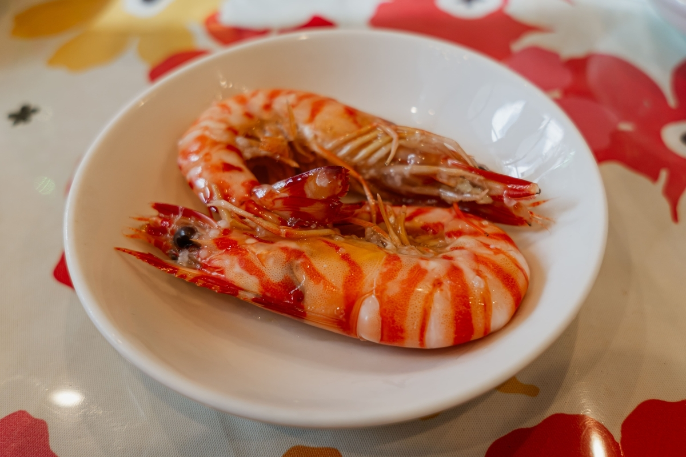

&#x3000;エビ、ゆで上がりの姿。

&#x3000;仕上がった物は順次円台に運ばれてきて、「1人2個ね～」のように個数が伝えられます。苦手な食材とかは良い感じに分配してください。

&#x3000;このエビ、みんなはちゃんと剥いて食べてたけど私は（面倒くさくて）尻尾から殻ごとバリバリ食べてました。柔らかくておいしかったです。

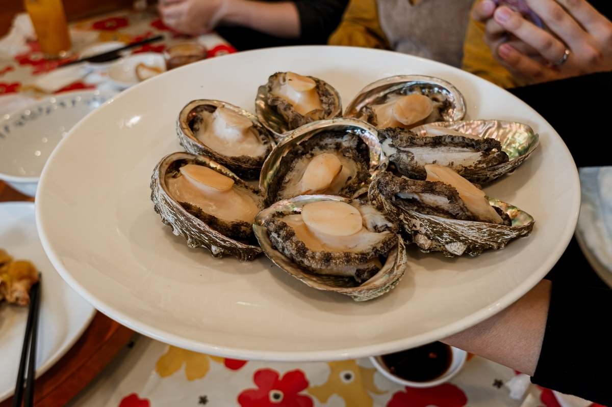

&#x3000;これまた良さそうなアワビ…！これも柔らかくておいしかった（感想バリエーションの無さ

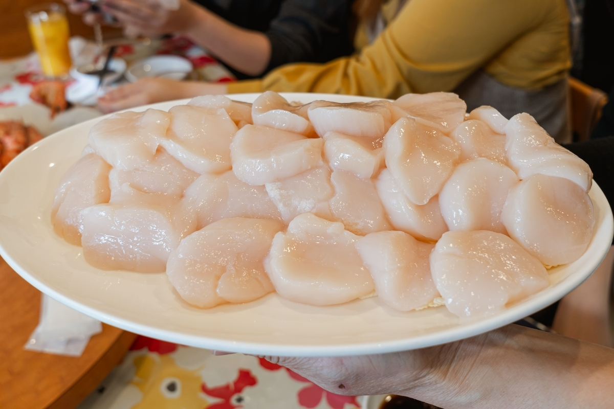

&#x3000;ホタテ。北海道産とのこと。  
&#x3000;刺身で食べても絶対美味しいのにレア程度に火を通してしまう贅沢さよ…。

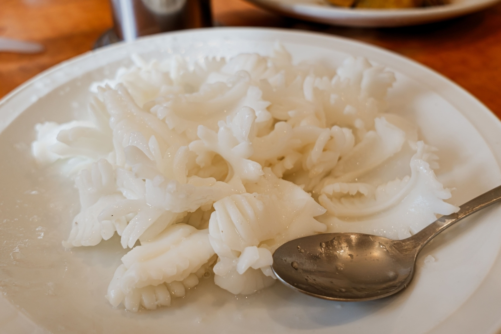

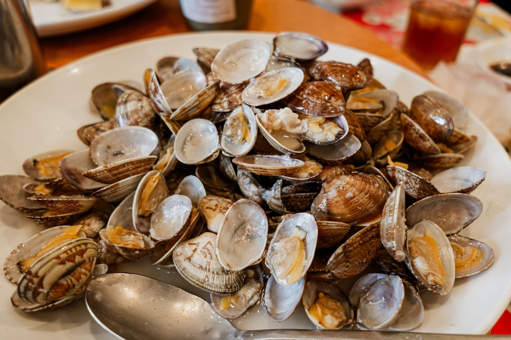

&#x3000;ゆで上がりイカとあさり。  
&#x3000;イカも柔らかいし素材としてはシンプルなのに旨味がしっかりしてておいしい。あさりは好きに食べて～とのことだったんですが1/3くらい残ったので最後のお粥の具として使われることになりました。また会おうな。

&#x3000;あと写真が無いけどタラのすり身団子が入って海鮮チームは以上になります。お次は肉のターンだ！

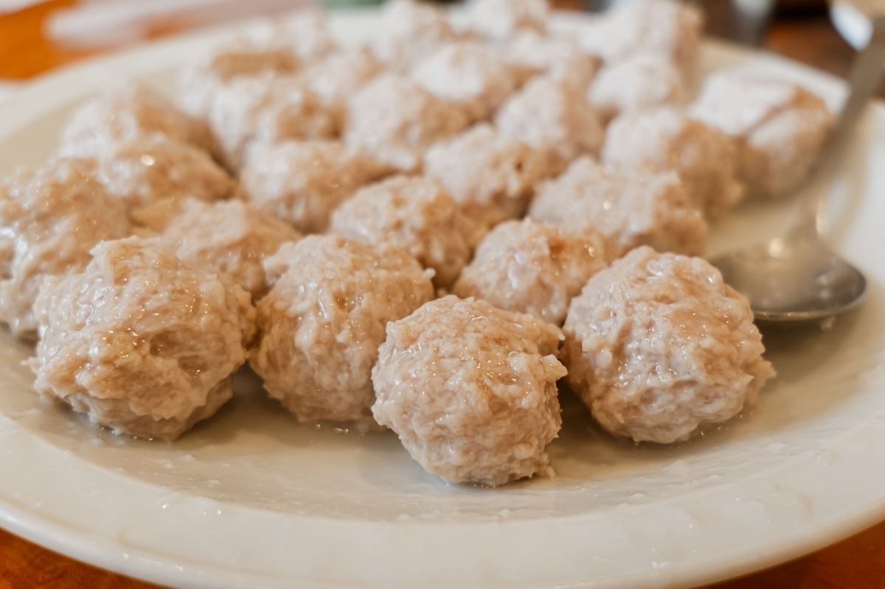

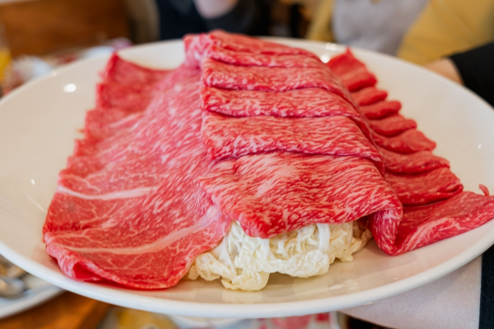

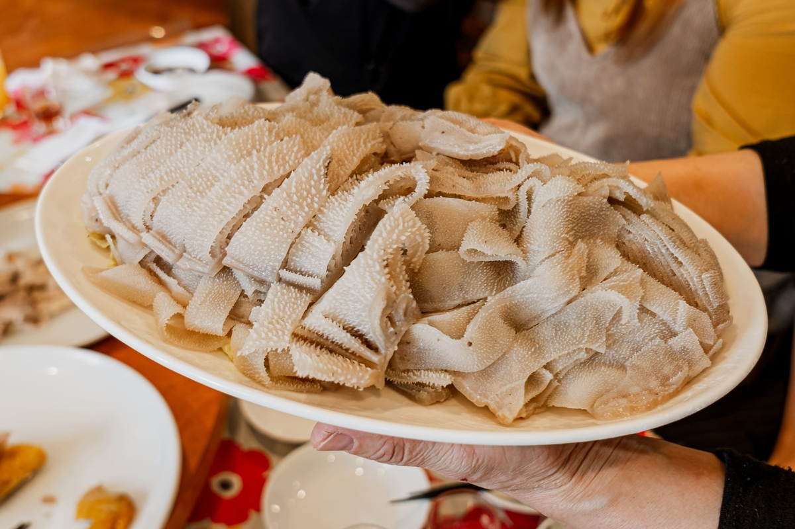

&#x3000;肉団子といかにも質が高そうな牛肉とセンマイ。  
　肝心なところでまた写真が無いんですが、名古屋コーチンが「ただ茹でただけなのにどうしてこんなに旨味がしみ込んだ味がするの…！？」と驚きの味で最高でした。噛む度に肉の旨味が染み出してくる感覚は初めてだよ…。

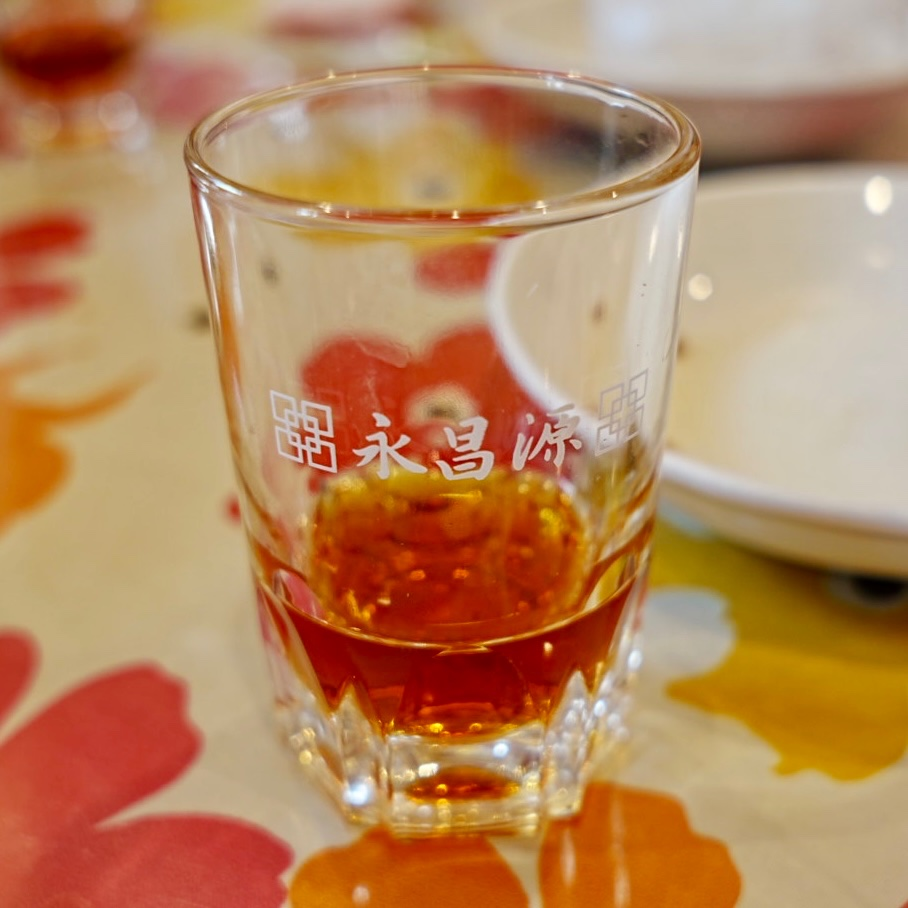

&#x3000;途中で出て来た紹興酒。写真は何年の奴だったかな…。

&#x3000;突然箱に入ったいかにもなボトルが運ばれてきて、後ろでザワザワしてるなと思っていたら

> A「〇〇さんが出してくれるって！」  
> 私「！？」  
> B「やったー！」  
> C「ごちです！」  
> D「15年モノの紹興酒だって～」  
> 私「いいけどいくらなの！？しらないよ！？」  
> 私「あとなんか2本あるけど！？！？」

&#x3000;**値段も見てないなんか良さそうな酒のボトルが突如としてお出しされる卓、怖すぎる。**  
&#x3000;この店現金会計だからね？？（と言いつつなんかあったらATM行ってもらうか…と思っていた人）

&#x3000;ちなみにこの15年モノにつづいて、10年、3年と頂くことになり…

* 15年：シロップのような甘さと濃さ。ちびちび飲みたい感じ。
* 10年：色が一番濃いので年代とイコールではないんだという学び。濃すぎず若すぎずという感じで一番好みでした。
* 3年：アルコール～！なキツさがある。年代を見てると「これが若さか…」という感想が出てきてしまう味。

&#x3000;見事に見た目も味も個性があって貴重な飲み比べをすることができました。〇〇さん（と最終的に負担してくれた人たち）ごちそうさまです。

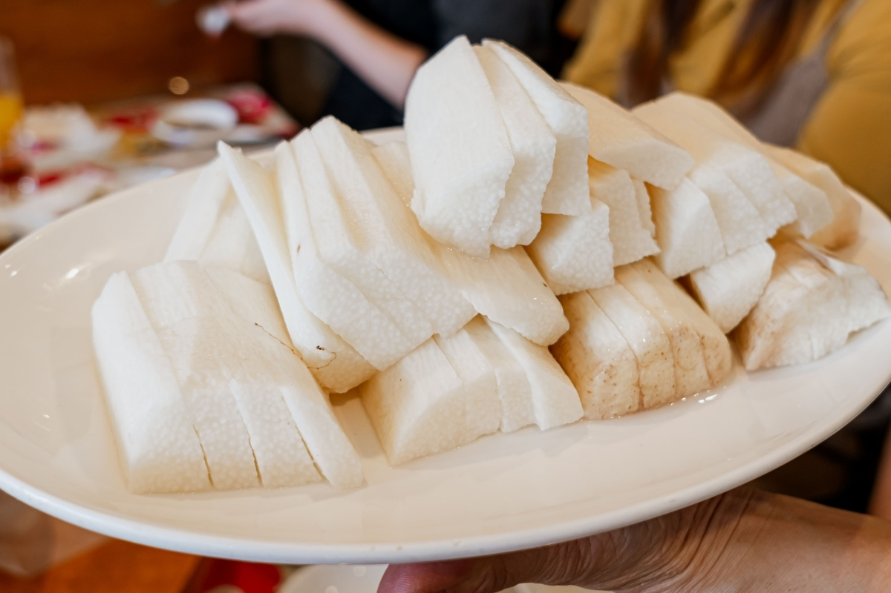

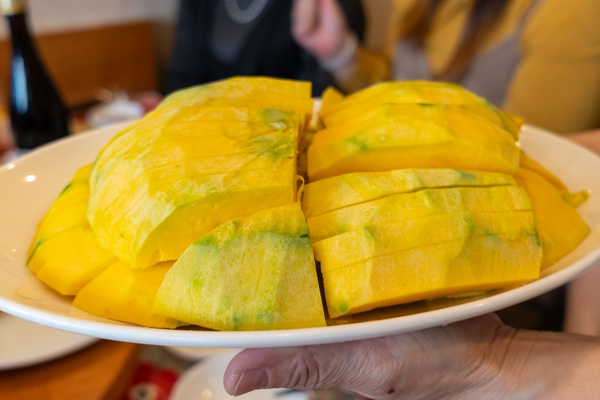

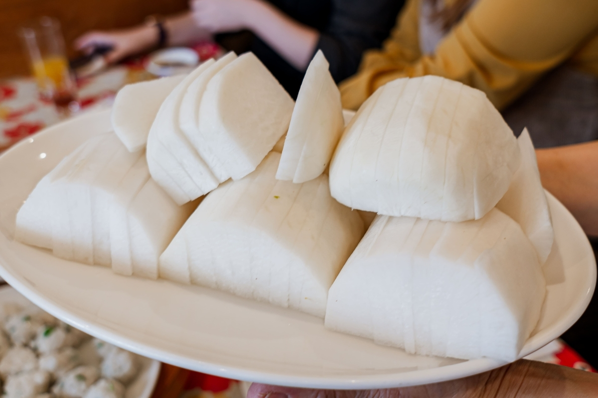

&#x3000;最終チームは野菜陣。山芋、かぼちゃ、大根と、写真が無いけど巨大しいたけ。

&#x3000;ここまでに通ってきた食材の出汁がシンプルな野菜たちの土台と合わさって良い味出してるんだこれが…。個人的にすりおろしてない山芋が好きなんですけど、これはシャキシャキとほくほくがいい塩梅で最高だった。あとしいたけね～～肉厚で噛み応えのある身にそこから染み出す出汁…こんなの不味いワケがなく…。

&#x3000;正直この辺りまでくると野菜の質量が苦しくなってくるんですが、でも肉だったらもっと辛いな～という感じはするので流れとしては丁度いいのかもしれません。

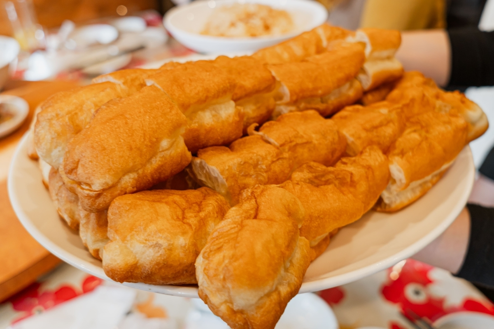

&#x3000;いよいよ最終段階！  
&#x3000;最後にこの油条（揚げパン）を入れて、しみしみになったところをいただきます。

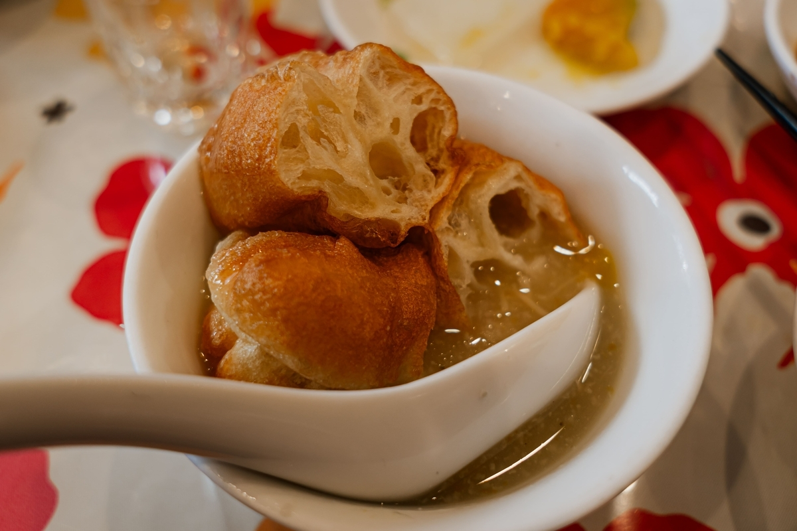

**＼これが約2時間かけて仕上がったお粥の姿／**

&#x3000;知ってはいたけどもうスープですねこれ。ひと口飲んで感じるのは圧倒的エビの存在。同卓の人が「カニ…？」と入っていないはずの食材を言ってて笑ったんですが、そのくらいｷﾞｭ！と来る甲殻類の風味があるのは頷けるところです。パンと一緒に干し貝柱も追加されてるようなのでそこで魚介ポイントが加点されているというのはあるかもしれない。

&#x3000;ベースは魚介、旨味を肉類で追加して、野菜で全体を整える…と言ったところでしょうか。あんなにバラバラの食材が入っているのに雑味が一切なく、そして個々の良いところだけが残されたような旨味があることに驚きでした。食材自体も良いものを使っているからこそ、なんだろうなあ…。

&#x3000;ライブ感含め、ここでしか味わうことのできない最高の1杯でした。

## 終わりとまとめ

&#x3000;そんなこんなで約2時間かけて全行程が終了。  
&#x3000;途中にも書きましたがお会計は現金のみ！なので、集金の際はご注意ください。この日は後ろにも予定が入っていたみたいで、この時間までには～と言われていたものの会計でワタワタしてたらちょっと押してしまいました。ごめんなさい。

&#x3000;ちなみにメインはお粥になりますが、おみやげシステムがあり最初に出て来た塩鶏をはじめ、他にもいくつかのメニューをおみやげとして頼むことができます。おそらくその時々にもよるかとは思うのですが、ちまき、もち米団子、アヒルの醤油煮などなど。ここは個別会計なので自由に頼んでもらうのが良いと思います。（こそっと幹事特典でアヒルを1パックいただきました。嬉しい。

&#x3000;余談ですが、元々顔馴染んだメンツ＋趣味繋がりなので大分ワイワイやっていたところ、それを見た店員さん（他の方含め中国出身と思われる人たち）に「すごく楽しそう！趣味の友達？みんな仲良くていいね！他の時はここまでならないよー！」と嬉しそうにコメントされました。ステレオタイプな感想かもしれないのですが、中国の方ってに賑やかなものが好きそうな印象があるので、美味しいご飯と美味しいお酒、楽しい仲間と盛り上がっている姿はとても良いものに見えたのかもしれません。事実、少なくとも私はとーーっても楽しく美味しい時間を過ごせたので、他人目線でもそう見えたのであれば喜ばしい限りです。

&#x3000;ずっと行きたいと思っていた場所に行けたのは他でもない参加者の皆さんのおかげなので、この場を借りてお礼を。来年もボドゲなりご飯なり、楽しい＋美味しいを目指して色々やっていけたら良いなと思います。これからもよろしくお願いします。

&#x3000;おしまい。
