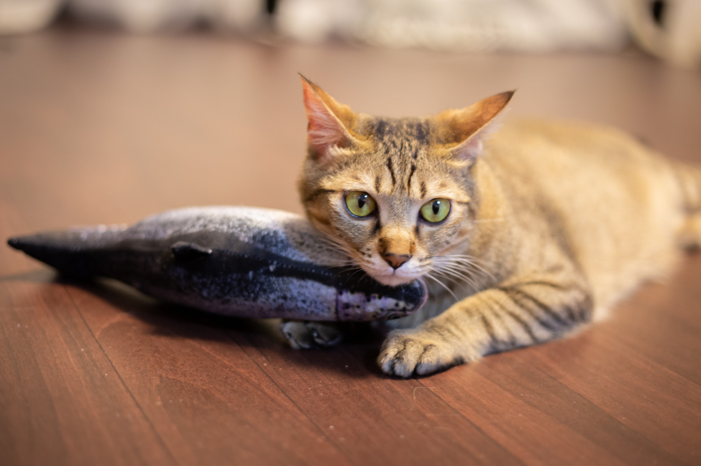
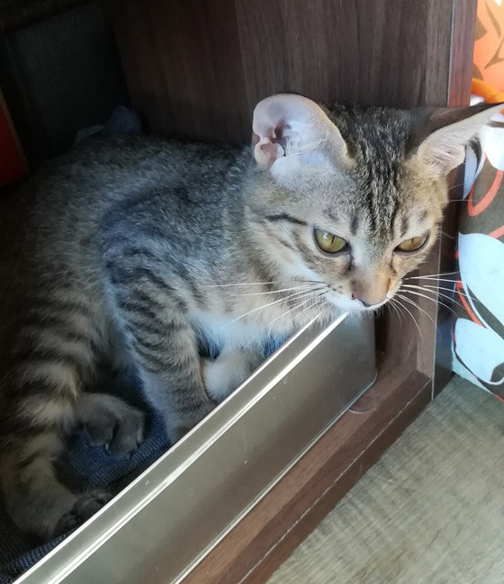
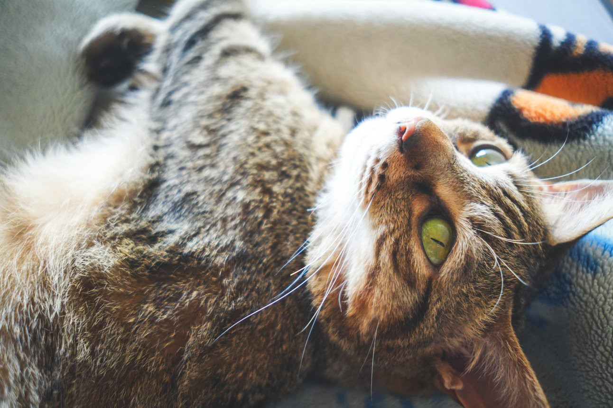
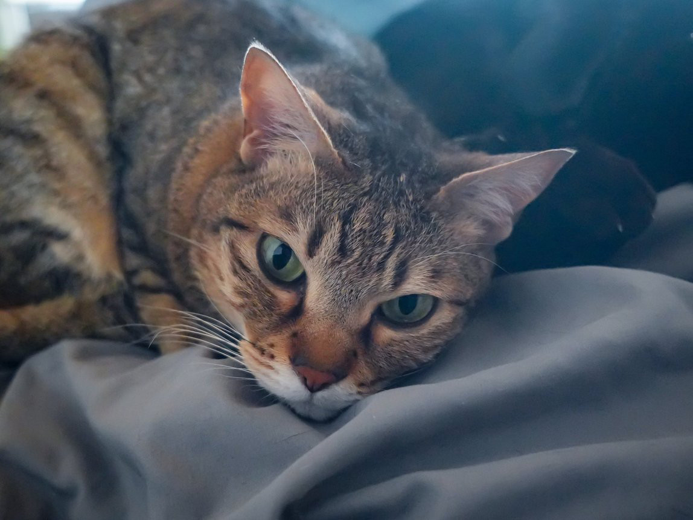
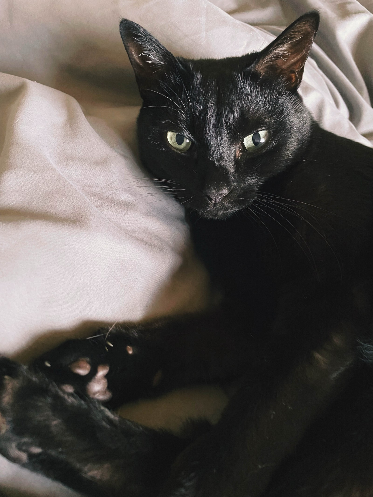
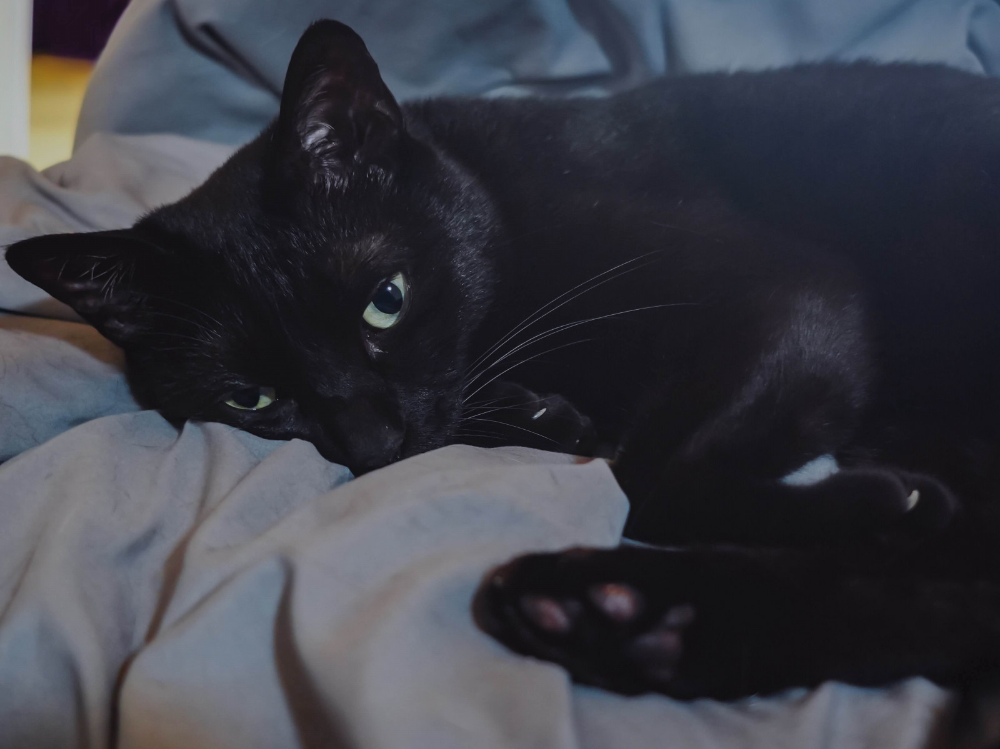
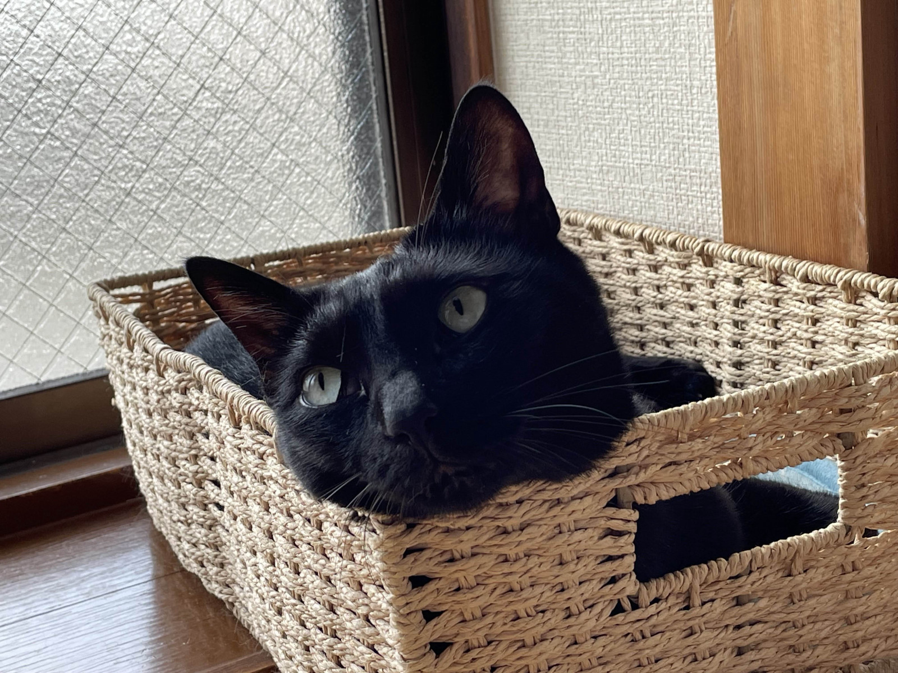

**この記事は[あなたのおうちのﾈｺﾁｬﾝ語り Advent Calendar 2025](https://adventar.org/calendars/11722)の参加記事です。**

---

　ﾈｺﾁｬﾝアドカレ！？参加したい！！と言いつつこんな頃合いになってしまいました。

　みんないつだって「うちのねこ」のことは語りたいものだと思うのですが、いつぞやに誰かが「<u>**いつか彼らがいなくなってしまう時が来ても、猫のことを知っている人が多いほど悲しみは分散されるかもしれない**</u>」みたいなことを言っていてですね。大事なことなのに記憶がふんわりすぎて申し訳ないんですが、わたしもそんな気がしているのでぜひこの機会にうちの猫たちのことを知っていって欲しいなと思います。

　ということで、うちには2匹の猫がいます。どちらも雄、2018年春生まれの大体7歳くらい。  
　元は5匹の兄弟で、黒猫が4、キジトラが1。そのうちの2匹を保護猫カフェから譲り受けました。保護猫カフェについては後述するとして、それぞれの紹介をしていきましょう。

## キジトラ

　同胎なので厳密な上下は無いと思いつつ、どちらかといえば末っ子気質なポジションのキジトラです。真名は色々な経緯で身バレの可能性があるため伏せますが、それをモジって家では「もじょ」とか「じょにき」とか「おじょじょ」とか呼ばれています。

　お店にいた頃＝出会った頃は生後4か月ほどで、まだぽわぽわの子猫ちゃんでした。他の兄弟より体が小さかったようで、頻繁に体調を崩し、店長さんの手を煩わせていたと聞きます。店に行った時も昼間は大体どこかのカゴか誰かの体をベッドにして寝ていて、良く寝る子だなあと思ったものです。

　お客さんの膝に乗るのも大好きで、店では膝乗りサーファーとして有名でした。**こんなちっちゃい子猫が自分の膝ですやすやしてたらそりゃあもう誰だってリピートしてしまうがな。** という感じで、良き看板猫だったようです。ちなみに現在も膝好きは健在で、立って作業をしていれば足元で「すわりなさーい！」と文句を言い、ちょっとしゃがんだりすれば「ひざ…ありますよね…？」と人の足に手をかけてくる勢いです。※そのままの姿勢でいると、ぐいぐい割り込んできて不安定な姿勢のまま「ひざ、よし！」と勝手に寛いでいます。

　昔話が捗ってしまいましたが、性格っぽいことも触れておきましょう。本来のキジトラというと、イエネコの祖先とされているリビアヤマネコと同じ模様をしており、遺伝子的にも近いと言われています。性格はワイルド…というより、うちのキジトラにおいては**オラオラ**しているが近いかもしれません。人の膝で寝るのも、他の猫をベッドにするのも、大体が全部**相手の都合を無視**してきている強さがあります。恐怖心よりも好奇心が強いタイプで、初めて動物病院に連れて行った時もすぐにキャリーから出て来て、あれはなに？このおとはだれ？とあっちこっち行こうとするのを宥めているほどでした。（黒猫はいまだにミリともキャリーから出ようとしません笑）

　模様と言えば、キジトラには濃い寄りと薄い寄りがいるなと思って他所の猫を見ていたりします。うちのキジトラは薄い寄り。なので他所の子を見る時も黄色めのキジトラが好きだったりするんですが、猫の中では少数派かもしれません。あと柄と言えば、口元から顎にかけてが白いのも好きポイントです。いやもう全部好きなんですが。**猫、すごすぎる。**

　鳴き声は多分ダミ声とされるタイプ。ニャーじゃなくてア”ーー。カワイイね。  
好きなものは細い紐。**iPhoneに付いてきたイヤホン**みたいな材質が大好きで、もう何本犠牲になったか分かりません。通話している時に「なんか急に切れたな？」と思ったら**コードが千切れていた**時はもう…。充電コード系はほとんどやられてしまうので太い仕様の物を買うか、保護するカバーを付けています。

　朝起こしてくるのは大体キジトラで、あの手この手で人を起こそうとします。足元をﾁｮｲﾁｮｲしたり、耳元で大声を出したり、鼻を噛もうとしたり。ちなみに引っ掻きはしませんが甘噛みは普通にしてくるのでうっかりしてると人間が負傷します。

　膝乗りのこともあり人は好きな方なのだと思いますが、猫に対してもそうなのでくっつく先があればどっちでも良いのかなという気がしています。人に依存しきらない関係ができるのは多頭飼いの良いところですね。

　そういえば序盤に**体が小さく体調も崩しがちだった**と書きましたが、今ではそんな気配もなく、体重は黒猫より増え（4.7kgくらい）、これといった風邪も引かず元気に過ごしています。

## 黒猫

　さて次は黒猫について。キジトラに比べるとちゃんと「**猫っぽい**」のが黒猫です。

　基本的には「にゃー」と鳴く（時々わんわん言う）、すらっとした体系で運動神経が良くハイジャンプも得意、知らないものは警戒しがちで病院へ行くと動かない毛玉になり、普段はひとりでいるけど甘えたい時は爆ゴロ、などなど。猫と暮らすのはこの2匹が初めてなので、もしキジトラだけだとしたら一般的な「猫」の概念に大きな偏りが発生していたことでしょう。

　こちらも真名は伏せますが「ジェット」みたいな響きのため、よく「○○ットさん」と呼ばれています。（例：もふっとさん、まるっとさん

　黒猫と称していますが、厳密にはキジトラ同様雑種生まれなので**めちゃくちゃ濃いトラ柄の猫**という感じです。よーーく見るとうっすら縞模様があるのが分かって兄弟を感じる瞬間。

　先述した通り猫らしい猫なので、知らないものが運び込まれると真っ先に匂いチェックをしたり、日々の安全点検（俗にいうニャルソック）をするのも黒猫の仕事です。カラスの鳴き声がするとﾋﾞｭｯと窓際へ駆け寄っていきますが、キジトラでは一度も見たことがない仕草なので性格の違いを感じておもしろいです。

　キジトラとの違いでいうとこれが結構あって、要求であっても甘噛みや引っ搔いたりは一切しません。キジトラに対してすら威嚇しているところを一度も見たことがないので安心安全の猫です。普段は1匹でいることが多く、大抵は部屋のいたるところのナワバリ（黒猫だけの場所というエリア）で寝ています。リビングより先の玄関側は我が家では猫出禁のため、活動範囲はそんなに広くないのですが、個別の居場所を持つ黒猫と膝（か黒猫）があれば良いというキジトラとでパーソナルスペース的なものは程よく保たれているようです。

　食に関しても好みの違いがあり、基本的にはなんでも食べる**食欲大魔神**。なのにキジトラの方が太いのは何故…？というのは置いておいて（おそらく運動量のせい）、キャットフード以外の食べ物へも興味深々です。無糖無脂肪のヨーグルトを時々あげているのですが、黒猫はパックを開けた瞬間寄って来るのに、キジトラは匂いを嗅いだだけでﾌｰﾝ…といなくなってしまいます。ほとんど同じ環境で育っているはずなのに、こういう違いってどこででるんでしょうか。気になります。

　黒猫のかわいいポイントも触れておきましょう。それは何と言ってもキャンディーケーンのような鍵しっぽ。あまり写真には写らない範囲なので分かりやすいものがなく、画像でお伝えできず**大変に残念**なのですが、太め短めのしっぽをブンブン振っているのはとてもかわいいです。ちなみにキジトラもしっぽの先端だけ小さく折れていて、たまに猫又のように割れて見える時があります。鍵しっぽは「幸運をひっかける」として縁起の良いものとされているようなので、2匹分で2倍！としてこれからも愛でていきたいと思います。

## 保護猫カフェについて

　名前の通り「保護猫がいるカフェ」と言いたいところなのですが、私の知るところではカフェ要素が付いている施設は少ないかもしれません。猫カフェもそう？そうかも。

　基本的にはどこかしらの保護団体があって、そこでなにかしらの事情で保護された猫たちが保護猫カフェへやってきます。そのため在籍猫の年齢はバラバラですが、春・秋生まれの子猫が保護され夏・冬頃にやってくるというパターンは多いようです。

　うちの猫たちは5匹の兄弟でしたが、1匹用のキャリーに詰め込まれ、ボランティアさん宅の庭に捨て置かれていたと聞いています。生後2か月頃の話です。そこから保護団体の方でしっかりとケアをされ、わたしがよく「猫実家」と呼んでいる保護猫カフェへとやってきました。これが生後4か月くらいの話。

　特殊な事情が無い限り、保護猫カフェにいる猫たちはどの子も里親募集中になります。  
　…が、ここで言いたいのはみんな猫を引き取ろう！ではなく。

　**保護猫カフェへ行こう！！！！**

　です。別に里親になるつもりがなくても良いんです。環境の都合でそれが難しい人もいることでしょう。ですが、お店へ行って猫と触れ合うだけでも猫たちの遊び相手やら、人慣れの練習やらで猫にとってのメリットがあります。現実的な話をすれば、日々の食費や医療費やらのサポートにもなります。~~人間側のメリット？かわいい猫ちゃんと一緒にいれるだけでいいでしょうが~~

　そうしてたくさんの人たちと触れ合い、元気で健康に過ごしている猫たちが誰かのおうちへ旅立っていく。  
　お店の猫枠が空く。  
　保護団体で順番を待っている新たな猫がイン！  
　そしてまたお客さんにかわいがられ、新たなおうちへ…。

　何度も言いますが遊びに行くだけで良いんです。それだけで立派な保護猫へのサポートになります。地方だと選択肢に限りがあるかもしれないのですが、もしお近くに行けそうなお店があればぜひ一度行ってみて欲しいです。体感、商業施設としての猫カフェより商売っ気のない、純粋に人慣れした猫が多いと思っています。時期を狙えば元気いっぱいスタミナおばけの子猫がいるのもおすすめポイント。

　もちろん、保護猫カフェだからといって**どこも◎とは言えない**のは正直なところです。「ここ行ったけど駄目だったぞ」というのがあったらこっそり教えてください。代わりにおすすめ店を共有します。こっそりね。

## おわり

　ということでおまけが長くなってしまいましたが、以上「うちのねこの話」でした。  
　少しでも猫たちのことを知ってもらえて、保護猫にも興味が出てくれたら良いなと思います。

　それでは皆様よい休暇をお過ごしください。すべての猫たちが健やかに暮らせますように。
